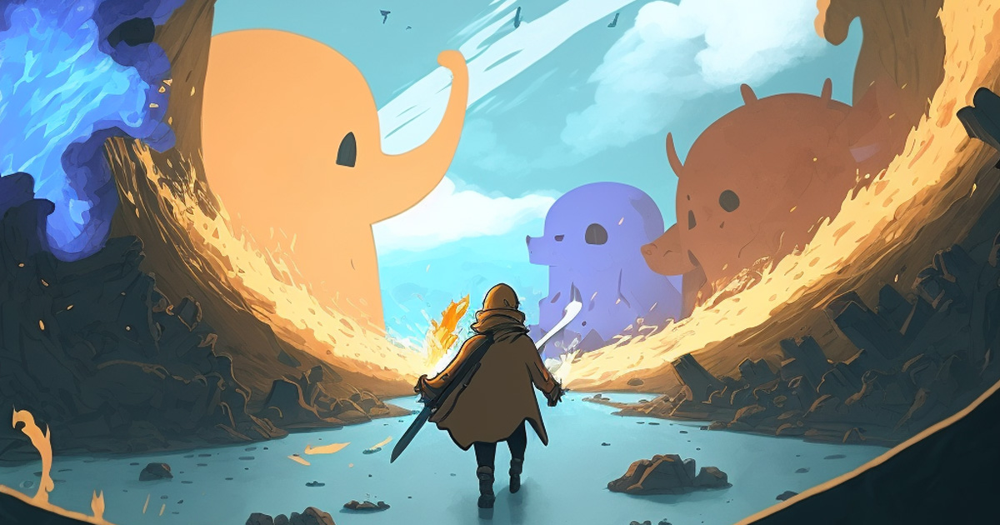

# Esittely

### Tervetuloa Mementomori.social-yhteisöön

Mukavaa, että olet löytänyt tiesi tänne! Mementomori.social on [Mastodon](https://joinmastodon.org/)-instanssi, jonka tähtäimenä on avoin ja terveellinen sosiaalisen median alusta. Instanssi sijaitsee Suomessa, mutta netillä ei ole maarajoja. Instanssille voi rekisteröidä kuka tahansa. Tule sellaisena kuin olet!



Dokumentaation tarkoituksena ei ole ainoastaan auttaa, mutta myös lisätä avoimuutta ja läpinäkyvyyttä. On tärkeää tietää mistä on kyse, kun luot tunnuksen johonkin palveluun. Täältä saat toivottavasti kaiken tarvittavan tiedon, joka lisää mielenrauhaa palvelun käytössä.

<figure><figcaption></figcaption></figure>

### Alkuun pääseminen

Jotta pääset Mastodonissa alkuun, tarvitset ensin tunnuksen. Oletan, että sinulla on jo sellainen, kun kerran lueskelet tätä sivua, mutta jos ei, voit rekisteröidä omasi [rekisteröimissivulla](https://mementomori.social/auth/sign\_up). Ennen tunnuksen rekisteröimistä saatat kuitenkin haluta tietää lisää paikasta, johon rekisteröidyt, Mastodonista ja säännöistä. Jatka siis lukemista!


Hei! Tämä sivu on vielä hieman kesken. Palaa myöhemmin uudelleen, niin löydät lisää luettavaa.

