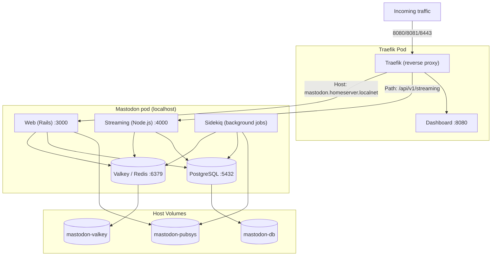

Just out of interest I thought it would be nice to try and play around with
mastodon on my home server. Better yet, could I run it easily in containers.
Answer is yes I can, and I write instructions how you can too!

This doc describes you how you can experiment
[BirdUI](https://github.com/rollecode/mastodon-bird-ui) or mastodon in general.
We build simple mastodon setup with containers for different roles. Containers
are running in one pod in [podman](https://podman.io/). There is
[traefik](https://github.com/traefik/traefik) container doing load balancing as
reverse proxy.

There are plenty of docs how to run mastodon in docker, you
can use those to test BirdUI just by exchanging the container image url
to point to birdUI ones instead of the originals.



# Quick experiment with `podman kube play`

Let's start by creating working directory for the tests:
```sh
mkdir ~/mastodon-birdui
cd !$
```

Create a file defining the pods the kubernetes way. This is just one way,
but let's start with it. The file contains mastodon configuration options.
I just setup something that should not federate and keeps it minimal. Go
ahead and enhance it by following
[mastodon configuration guide](https://docs.joinmastodon.org/admin/config/).

```sh
cat > mastodon-pod.yaml <<EOF
---
apiVersion: v1
# This configmap is used to define the env variables that Mastodon uses.
kind: ConfigMap
metadata:
  name: mastodon-env
data:
  # DB Config
  POSTGRES_USER: mastodon
  POSTGRES_PASSWORD: mysecretdbpasswd # XXX Generate this
  POSTGRES_DB: mastodon_production
  DB_USER: mastodon
  DB_NAME: mastodon_production
  DB_PASS: mysecretdbpasswd # XXX Generate this
  DB_PORT: "5432"
  DB_HOST: localhost
  # Site Config
  ALLOWED_PRIVATE_ADDRESSES: 192.168.117.0/24 # CHANGE to your home network
  LOCAL_HTTPS: false
  LIMITED_FEDERATION_MODE: true
  SECRET_KEY_BASE: "e59f561d592a9" # XXX Generate this
  OTP_SECRET: "2a3b41e7d69d66bf0b" # XXX Generate this
  LOCAL_DOMAIN: mastodon.homeserver.localnet # XXX change to your servers name in you network
  IP_RETENTION_PERIOD: "31556952"
  SESSION_RETENTION_PERIOD: "31556952"
  ACTIVE_RECORD_ENCRYPTION_DETERMINISTIC_KEY: okj1Ad # XXX Generate this
  ACTIVE_RECORD_ENCRYPTION_KEY_DERIVATION_SALT: Lo6Q # XXX Generate this
  ACTIVE_RECORD_ENCRYPTION_PRIMARY_KEY: WEUBzsSwMKeV # XXX Generate this
  VAPID_PRIVATE_KEY: Qd1KNmM # XXX Generate this
  VAPID_PUBLIC_KEY: BGFXvIU # XXX Generate this
  AUTHORIZED_FETCH: false
  # Valkey Config
  REDIS_HOST: "127.0.0.1"
  REDIS_PORT: "6379"
  # XXX Mail Config, SMTP settings explnations here: https://docs.joinmastodon.org/admin/config/#email
  SMTP_FROM_ADDRESS: "me@example.com"
  SMTP_LOGIN: "me@example.com"
  SMTP_PASSWORD: "my_smtp_passwd"
  SMTP_PORT: "587"
  SMTP_SERVER: "mail.example.com"
  SMTP_DELIVERY_METHOD: "none"
  SMTP_TLS: "true"
---
apiVersion: v1
kind: Pod
metadata:
  name: mastodon
  annotations:
    # the following annotations are instructions for podman
    io.kubernetes.cri-o.ContainerType/db: container
    io.kubernetes.cri-o.ContainerType/valkey: container
    io.kubernetes.cri-o.ContainerType/sidekiq: container
    io.kubernetes.cri-o.ContainerType/streaming: container
    io.kubernetes.cri-o.ContainerType/web: container
    io.kubernetes.cri-o.SandboxID/db: mastodon
    io.kubernetes.cri-o.SandboxID/valkey: mastodon
    io.kubernetes.cri-o.SandboxID/sidekiq: mastodon
    io.kubernetes.cri-o.SandboxID/streaming: mastodon
    io.kubernetes.cri-o.SandboxID/web: mastodon
    io.kubernetes.cri-o.TTY/db: "false"
    io.kubernetes.cri-o.TTY/valkey: "false"
    io.kubernetes.cri-o.TTY/sidekiq: "false"
    io.kubernetes.cri-o.TTY/streaming: "false"
    io.kubernetes.cri-o.TTY/web: "false"
    io.podman.annotations.autoremove/db: "FALSE"
    io.podman.annotations.autoremove/valkey: "FALSE"
    io.podman.annotations.autoremove/sidekiq: "FALSE"
    io.podman.annotations.autoremove/streaming: "FALSE"
    io.podman.annotations.autoremove/web: "FALSE"
    io.podman.annotations.init/db: "FALSE"
    io.podman.annotations.init/valkey: "FALSE"
    io.podman.annotations.init/sidekiq: "FALSE"
    io.podman.annotations.init/streaming: "FALSE"
    io.podman.annotations.init/web: "FALSE"
    io.podman.annotations.privileged/db: "FALSE"
    io.podman.annotations.privileged/valkey: "FALSE"
    io.podman.annotations.privileged/sidekiq: "FALSE"
    io.podman.annotations.privileged/streaming: "FALSE"
    io.podman.annotations.privileged/web: "FALSE"
    io.podman.annotations.publish-all/db: "FALSE"
    io.podman.annotations.publish-all/valkey: "FALSE"
    io.podman.annotations.publish-all/sidekiq: "FALSE"
    io.podman.annotations.publish-all/streaming: "FALSE"
    io.podman.annotations.publish-all/web: "FALSE"
  labels:
    app: mastodon
    # Here we configure Traefik reverse proxy
    traefik.enable: "true"
    # LB for web port
    traefik.http.services.mastodon-web.loadbalancer.server.port: "3000"
    traefik.http.routers.mastodon-web.rule: "Host(`mastodon.homeserver.localnet`)"
    traefik.http.routers.mastodon-web.entrypoints: "websecure"
    traefik.http.routers.mastodon-web.service: "mastodon-web"
    traefik.http.routers.mastodon-web.tls: "true"
    # The following would setup redirect from http to https. No need here, but for an example.
    # traefik.http.middlewares.mastodon-web-https-redirect.redirectscheme.scheme: https
    # traefik.http.routers.mastodon-web.middlewares: "mastodon-web-https-redirect"
    # traefik.http.routers.mastodon-web-secure.rule: Host(`mastodon.homeserver.localnet`)
    # traefik.http.routers.mastodon-web-secure.tls: "true"
    # LB for streaming port
    traefik.http.services.mastodon-streaming.loadbalancer.server.port: "4000"
    traefik.http.routers.mastodon-streaming.rule: "(Host(`mastodon.homeserver.localnet`) && PathPrefix(`/api/v1/streaming`))"
    traefik.http.routers.mastodon-streaming.entrypoints: "websecure"
    traefik.http.routers.mastodon-streaming.service: "mastodon-streaming"
    traefik.http.routers.mastodon-streaming.tls: "true"
    # traefik.http.middlewares.mastodon-streaming-https-redirect.redirectscheme.scheme: https
    # traefik.http.routers.mastodon-streaming.middlewares: "mastodon-streaming-https-redirect"
    # traefik.http.routers.mastodon-streaming-secure.rule: (Host(`mastodon.homeserver.localnet`) && PathPrefix(`/api/v1/streaming`))
spec:
  containers:
    - args:
        - postgres
      envFrom:
        - configMapRef:
            name: mastodon-env
            optional: false
      image: docker.io/library/postgres:14-alpine
      name: db
      ports:
        - containerPort: 3000
          hostPort: 3000
        - containerPort: 4000
          hostPort: 4000
        - containerPort: 9200
          hostPort: 9200
      livenessProbe:
        exec:
          command:
            - pg_isready
            - -U
            - postgres
        initialDelaySeconds: 30
        periodSeconds: 10
        timeoutSeconds: 5
      resources: {}
      securityContext:
        capabilities:
          drop:
            - CAP_MKNOD
            - CAP_AUDIT_WRITE
      volumeMounts:
        - mountPath: /var/lib/postgresql/data
          name: mastodon-vol-db-pvc
    - args:
        - valkey-server
      image: docker.io/valkey/valkey:9-alpine
      name: valkey
      livenessProbe:
        exec:
          command:
            - valkey-cli
            - ping
        initialDelaySeconds: 10
        periodSeconds: 10
        timeoutSeconds: 5
      resources: {}
      securityContext:
        capabilities:
          drop:
            - CAP_MKNOD
            - CAP_AUDIT_WRITE
      volumeMounts:
        - mountPath: /data
          name: mastodon-vol-valkey-pvc
    - command: ["node"]
      args: ["./streaming"]
      envFrom:
        - configMapRef:
            name: mastodon-env
            optional: false

      image: ghcr.io/mementomori-social/mastodon-streaming:mementomods-2026-06-19
      # image: docker.io/tootsuite/mastodon-streaming:latest
      name: streaming
      livenessProbe:
        exec:
          command:
            - /bin/sh
            - -c
            - "curl -s --noproxy localhost localhost:4000/api/v1/streaming/health | grep -q 'OK' || exit 1"
        initialDelaySeconds: 30
        periodSeconds: 15
        timeoutSeconds: 5
      resources: {}
      securityContext:
        capabilities:
          drop:
            - CAP_MKNOD
            - CAP_AUDIT_WRITE
    - command: ["bundle"]
      args: ["exec", "sidekiq"]
      envFrom:
        - configMapRef:
            name: mastodon-env
            optional: false

      image: ghcr.io/mementomori-social/mastodon:mementomods-2026-06-19
      # image: docker.io/tootsuite/mastodon:latest
      name: sidekiq
      livenessProbe:
        exec:
          command:
            - /bin/sh
            - -c
            - "ps aux | grep '[s]idekiq' || false"
        initialDelaySeconds: 30
        periodSeconds: 15
        timeoutSeconds: 5
      resources: {}
      securityContext:
        capabilities:
          drop:
            - CAP_MKNOD
            - CAP_AUDIT_WRITE
      volumeMounts:
        - mountPath: /mastodon/public/system
          name: mastodon-vol-pubsys-pvc

    - command: ["/bin/bash"]
      args:
        [
          "-c",
          # "rm -f /mastodon/tmp/pids/server.pid; bundle exec rails s -p 3000",
          "while true; do foo; sleep 10; done"
        ]
      envFrom:
        - configMapRef:
            name: mastodon-env
            optional: false
      image: ghcr.io/mementomori-social/mastodon:mementomods-2026-06-19
      # image: docker.io/tootsuite/mastodon:latest
      name: web
      livenessProbe:
        exec:
          command:
            - /bin/sh
            - -c
            - "curl -s --noproxy localhost localhost:3000/health | grep -q 'OK' || exit 1"
        initialDelaySeconds: 60
        periodSeconds: 15
        timeoutSeconds: 5
      resources: {}
      securityContext:
        capabilities:
          drop:
            - CAP_MKNOD
            - CAP_AUDIT_WRITE
      volumeMounts:
        - mountPath: /mastodon/public/system
          name: mastodon-vol-pubsys-pvc
  restartPolicy: Never
  # Volumes for the various data you need persistent.
  volumes:
    - name: mastodon-vol-db-pvc
      persistentVolumeClaim:
        claimName: mastodon-db
    - name: mastodon-vol-valkey-pvc
      persistentVolumeClaim:
        claimName: mastodon-valkey
    - name: mastodon-vol-pubsys-pvc
      persistentVolumeClaim:
        claimName: mastodon-pubsys
EOF
```

That's quite bit of config file. Not everything is absolutely needed, but
let's start with this. All the configs you better tune to your liking, like
post lenght, vote item amounts etc. stuff people do change.

I'll explain here things you need to change, marked with XXX.

## Tunables you need to change

These values are the ones you need to change in `mastodon-pod.yaml` file.

* This is your hosts name wher you run podman.  
  `LOCAL_DOMAIN`  
* Just put any password here, it's for database connection  
  `POSTGRES_PASSWORD` for postgresql database  
  `DB_PASS` for mastodon to connect to database  
* These are keys [needed to be generated](https://docs.joinmastodon.org/admin/config/#secrets).  
  I'll describe later how to do these with `rails secret`.  
  `SECRET_KEY_BASE`  
  `OTP_SECRET`  
* These secrets we later generate with: `bundle exec rake db:encryption:init`  
  `ACTIVE_RECORD_ENCRYPTION_DETERMINISTIC_KEY`  
  `ACTIVE_RECORD_ENCRYPTION_KEY_DERIVATION_SALT`  
  `ACTIVE_RECORD_ENCRYPTION_PRIMARY_KEY`
* These secrets we later generate with: `rake mastodon:webpush:generate_vapid_key`.  
  `VAPID_PRIVATE_KEY`  
  `VAPID_PUBLIC_KEY`  
* If you wish to try mail sending, fill these with your mail providers info.  
  `SMTP Mail sending config`  

# Running Traefik for reverse proxy


[Traefik](https://github.com/traefik/traefik)
was new to me, so I wanted to learn it. I configured it to listen to
8443 and 8081 ports on my host for web/https traffic. It then listens to
podman socket to find mastodon containers to forward the traffic to.

It is fully capable of maintaining you letsencrypt or static certs for https.
I left it out here to simplify the setup. But you'll find tons of instructions
how to get that done if you wish to make this public to internet.

Traefik listens to podman socket for finding the ports to be served.
You need to start podman service to enable traefik to get the info:

```sh
systemctl --user enable --now podman.socket
```

Start traefik with this command:

```sh
podman run -d \
  --replace \
  --name=traefik \
  --net podman \
  --security-opt label=type:container_runtime_t \
  -v /run/user/${UID}/podman/podman.sock:/var/run/docker.sock:z \
  -p 8081:80 \
  -p 8443:443 \
  -p 8080:8080 \
  -l=traefik.http.routers.traefik.entrypoints=websecure \
  -l=traefik.enable=true \
  -l='traefik.http.routers.traefik.rule=(Host(`homeserver.localnet`) && (PathPrefix(`/api`) || PathPrefix(`/dashboard`)))' \
  -l="traefik.http.routers.traefik.service=api@internal" \
  -l="traefik.http.routers.traefik.entrypoints=websecure" \
  -l="traefik.http.routers.traefik.middlewares=dashboardauth" \
  -l="traefik.http.middlewares.dashboardauth.basicauth.users=admin:XXX_admin_passwd" \
  -l='traefik.http.routers.http-catchall.rule=hostregexp(`{host:.+}`)' \
  -l="traefik.http.routers.http-catchall.entrypoints=web" \
  -l="traefik.http.routers.http-catchall.middlewares=redirect-to-https" \
  -l="traefik.http.middlewares.redirect-to-https.redirectscheme.scheme=https" \
  docker.io/library/traefik:latest \
  --api.dashboard=true \
  --api.insecure=true \
  --entrypoints.web.address=":80" \
  --entrypoints.websecure.address=":443" \
  --providers.docker=true \
  --providers.docker.exposedbydefault=false
```

This does the following:

* Listen to 8081 (http) and 8443 (https) for incoming traffic
* Listen to 8080 for admin dashboard
* Allows anyone login to admin dashboard with no credentials asked.
  Never run it like this while connected to internet.
* Listens to podman for open ports

# Start mastodon containers for initialization


Remember there was mention we configure secrets later. Now its the time.

1. Start the containers in pod:

```sh
podman kube play mastodon-pod.yaml
```

2. Generate the secrets  
Check from the above tunables section where to use rails secret,
this is how you run it:  
```sh
podman exec -ti -e "RAILS_ENV=production" mastodon-web bundle exec rails secret
```
The similar with encryption init:

```sh
podman exec -ti -e "RAILS_ENV=production" mastodon-web bundle exec rake db:encryption:init
```

Similarly for the ones 

3. Initialize the database

```sh
podman exec -ti -e "RAILS_ENV=production" mastodon-web bundle exec rails db:setup
podman exec -ti -e "RAILS_ENV=production" mastodon-web bundle exec rails db:migrate
```

4. Create the admin user

```sh
podman exec -ti -e "RAILS_ENV=production" \\n  mastodon-web bin/tootctl accounts create \
  admin --email admin@example.com --confirmed --role Owner
podman exec -ti -e "RAILS_ENV=production" mastodon-web bin/tootctl accounts modify admin --approve
```

5. Initialization done. Stop and remove the containers. Data will remain in the volumes.

```sh
podman pod rm mastodon -f 
```

# Start the mastodon

Now we are done with all the configs. It's time to start the mastodon processes
for real. First we comment out the mastodon web sleep loop, and replace it with
a real process. We just used this container in sleep state to run the
initialization commands.

Change the hastag in `mastodon-pod.yaml` file from beginning of the higher line to
the beginning of the lower line:

```sh
# "rm -f /mastodon/tmp/pids/server.pid; bundle exec rails s -p 3000",
"while true; do foo; sleep 10; done"
```

So it looks like this:

```sh
"rm -f /mastodon/tmp/pids/server.pid; bundle exec rails s -p 3000",
# "while true; do foo; sleep 10; done"
```

And start the mastodon:

```sh
podman kube play mastodon-pod.yaml
```

It should be running now! If not, patches to guide welcome 😁

# Accessing the services

Mastodon with BirdUI should be available at: `https://mastodon.homeserver.localnet:8443`
and traefik proxy dashboard should be at: `https://mastodon.homeserver.localnet:8080`

# For experimenting

If you want to modify the configurations, change versions or otherwise stop and
start the services, edit the `podman-mastodon.yaml` and do:

```sh
podman pod rm mastodon -f && podman kube play mastodon-pod.yaml
```

If you want to wipe it all and start from scratch, do:

```sh
podman pod rm mastodon -f && podman volume rm mastodon-db mastodon-redis mastodon-pubsys
```

# Final note

Remember this is not for production. It is for fun nerding, evaluating and
perhaps developing.

My setup is not reachable from internet. However podman is excellent tool to
run it in production. For such case I'd convert the `mastodon-pod.yaml` into
quadlet setup with systemd. Podman 6.0 has a command to do that. Also you'd
need to secure the traefik and enable certs. Also mastodon configs should be
revaluated and secured. And mastodon container amounts tuned to handle the
traffic and user load.

For any further questions about BirdUI, contact Rolle, and for mastodon, well the community. The podman guide I can update if you find errors.

# Thanks

I used the kube format so I can try it also one day in OpenShift kube if there
are enough rainy days. Also as there was nice
[example in internet](https://github.com/gangrif/podman-mastodon) which I just
copied and started with. Also credits to this
[traefik blog](https://blog.cthudson.com/2023-11-02-running-traefik-with-podman/).
Also thanks for Michael for
[sending the PR for building containers of BirdUI](https://mementomori.social/@michael@thms.uk/116809542883037039).
And Naturally [Rolle](https://mementomori.social/@rolle) who created the
BirdUI and the whole mementomori thingie.

Happy nerding and good luck,  
[ikkeT](https://mementomori.social/@ikkeT)
