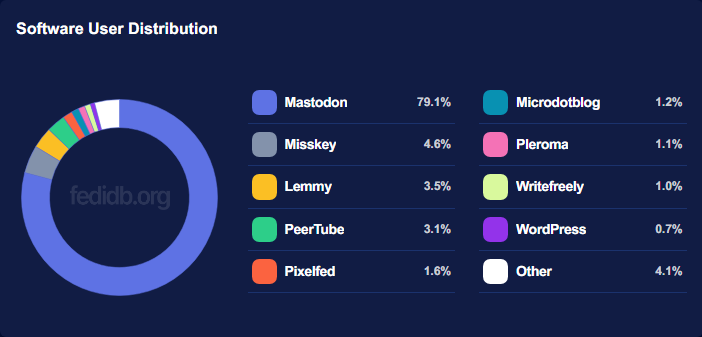

# Miksi Mastodon?

<figure><figcaption></figcaption></figure>

### Syy 1: Vihdoinkin sinä et ole tuote

Perinteisessä kaupallisessa ja keskitetyssä somessa (kuten Twitter tai Facebook) sinä ystäväiseni olet tuote. Korporaatiot tahkoavat rahaa sinun tiedoillasi. Saatat ajatella, että ei sillä ole väliä, mutta he oppivat sinusta, vakoilevat sinua ja seuraavat sinua joka paikkaan - ja tekevät tällä rahaa. He tietävät mistä tykkäät ja myyvät tämän tiedon mainostajille ja muille tahoille. Mastodonissa ei tarvitse murehtia mistään tällaisesta.

### Syy 2: Mastodon on ystävällinen paikka

Minä (kirjoittaja, Rolle) olen käyttänyt somea 2000-luvun alusta saakka, enkä ole koskaan nähnyt yhtä kivaa paikkaa kuin Mastodon. Mastodon on kyllä netissä ja netti on ruma paikka, mutta yleisellä tasolla Mastodon on munapää-vapaa alue.

### Syy 3: Turvallinen tila, hyvä paikka esim. vähemmistöille

Kuten kohdassa 2 mainitsin, Mastodon on turvallinen ja hyvä paikka, erityisesti LGBTQIA+ ja aistirajoitteisten yhteisöjä kohtaan. Syrjintää ei sallita. On olemassa instansseja, jotka ovat vieläkin muita suotuisampia alustoja, esimerkiksi [tech.lgbt](https://tech.lgbt).

### Syy 4: Enemmän käyttäjiä, kuin koskaan tulet tarvitsemaan

Mastodoniin rekisteröityy tuhansia käyttäjiä joka tunti. Tällä hetkellä [@mastodonusercount](https://mastodon.social/@mastodonusercount):n mukaan käyttäjiä on yli 13 miljoonaa.

### Syy 5: Nollatoleranssi vihapuheelle

Mastodon on yleisesti todella terveellinen paikka. On kyllä olemassa toksisia Mastodon-instansseja, jotka on pyhitetty esim. vihapuheelle tai kansallissosialismille, mutta nämä mätäpaiseet on laajalti defederoituja (Mastodon-maailmassa tarkoittaa sitä että koko palvelin ja kaikki sen käyttäjät on blokattu). Toisin kuin Twitterissä (2023) vihapuhe ja negatiivisuus ei ole ainoastaan sallittua, mutta myös algoritmien boostaamaa.

### Syy 6: Nollatoleranssi disinformaatiolle

Mastodonissa hyljitään disinformaatiota. Et tule näkemään conspiracy chartin teorioita Mastodonissa, jos sinulla on tunnus hyvällä instanssilla.

### Syy 7: Ilmainen

Tällä kertaa oikeasti. Mitään dataa ei myydä, eikä sinua seurata. Katso kohta 1.

### Syy 8: Ei mainoksia

Koska Mastodon on ilmainen ja avointa lähdekoodia, siellä ei ole mainoksia eikä koskaan tule olemaan. Palvelulla ei haeta kaupallista hyötyä.

### Syy 9: Avointa lähdekoodia ja oikeasti päivittyy koko ajan

Koska Mastodon on avointa lähdekoodia ja päivittyy, sitä voi kehittää kuka tahansa. Katso esim. [muutokset joita itse olen tehnyt](https://github.com/mastodon/mastodon/compare/main...ronilaukkarinen:mastodon:mementomori-social-mods-4.1.4-nightly-20230707). Tästä syystä Mastodon on tietoturvallinen ja nopea ja aina ajan tasalla. Tätä kirjoittaessa [Mastodonin lähdekoodin](https://github.com/mastodon/mastodon) on laittanut suosikkeihinsa 42 000 ihmistä, siitä on tehty 6300 omaa versiota ja projektissa on 845 koodaria mukana auttamassa.

### Syy 10: Paljon sovelluksia

Mastodonin rajpinta on avoin ja Mastodonilla on paljon sovelluksia joka laitteelle. Katso lisää osoitteesta [joinmastodon.org/apps](https://joinmastodon.org/apps).

### Syy 11: Osana sosiaalista verkkoa, Fediversumia

Mastodon ei ole ainoa sosiaalinen sovellus, joka tukee ActivityPubia (kuulemma Metan kehittämä Threads alkaa tukea pian myös). On olemassa muitakin palveluita, jotka kommunikoivat Mastodonin kanssa. Tämä tekee palvelusta entistä siistimmän!

<figure><figcaption>
<a href="https://fedidb.org/">FediDB.org</a>-tilastoja
</figcaption></figure>

### Syy 12: Upeita ominaisuuksia

Sisältövaroitukset, muokkaustoiminto, 500-∞ merkkimäärä, mukautettuja emojeita... kaikki ne ominaisuudet, joita toivoit Twitteriltä ovat Mastodonissa - ja enemmän. Voit jopa valita yksittäisen postauksen näkyvyyden privaatiksi tai seuraajille, vaikka sinulla olisi muuten julkinen profiili. Lisää ominaisuuksia kehitellään tälläkin hetkellä, tsekkaa [julkinen Roadmap](https://joinmastodon.org/roadmap).

### Eikö silti vakuuta?&#x20;

Tsekkaa [joinmastodon.org](https://joinmastodon.org/) ja [mastodon.help](https://mastodon.help/). Lisää luettavaa:






