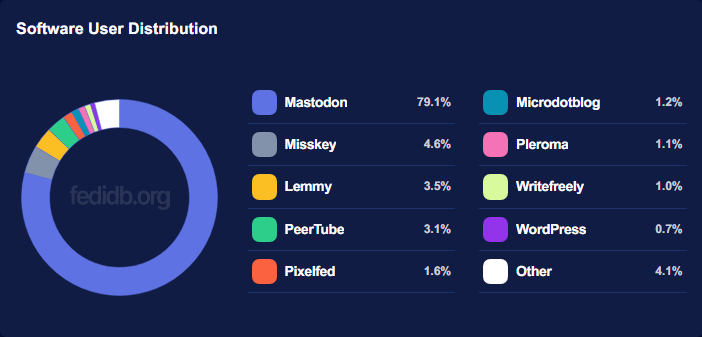

# Why Mastodon?

<figure><figcaption></figcaption></figure>

### Reason 1: Finally you are not a product

On traditional commercial and centralized social media you, my friend, are the product. Companies leech off of you and make money with your data. They track you, spy on you and learn everything about you, what kind of posts you like and sell that information to advertisers. On Mastodon you won't have to worry about any of that.

### Reason 2: Mastodon is a very friendly place

I've (the writer, Rolle) been using social media since the early 2000s and never seen friendlier place. Of course it's on the Internet and on the Internet there are always folks that poison the environment. But generally Mastodon is 99% turd-free.

### Reason 3: Safe space, friendly towards minorities

As per reason 2, Mastodon is generally a very safe space towards LGBTQIA+, disabled, etc. No discrimination is allowed. There are many instances specifically for forming even more safer spaces, like [tech.lgbt](https://tech.lgbt/explore).

### Reason 4: More active users than you ever need

Mastodon gets thousands of new users every hour. It has 13 million users as of writing this according to [@mastodonusercount](https://mastodon.social/@mastodonusercount).

### Reason 5: No hate speech

Mastodon is generally a healthy place. There are toxic Mastodon instances out there, but they are widely defederated (in Mastodon world the world means: whole server is blocked). Unlike on Twitter (in 2023) for example, hate speech and negativity is not only allowed, but boosted by algorithms.

### Reason 6: No disinformation

Mastodon is highly intolerant towards disinformation. You won't see things from the conspiracy chart on Mastodon if you have your account on a good instance.

### Reason 7: It's free

This time for real, no information is sold, no data is tracked, see reason 1.

### Reason 8: No advertisement

Because Mastodon is free and open source, it has no advertisement and never will.

### Reason 9: Open source and constantly updating

Because Mastodon is open source, it can be developed by anyone, even me. Look at [all the changes I've made](https://github.com/mastodon/mastodon/compare/main...ronilaukkarinen:mastodon:mementomori-social-mods-4.1.4-nightly-20230707). For this reason Mastodon is secure and speedy and always up to date. As of writing this [Mastodon's GitHub repository](https://github.com/mastodon/mastodon) has baffling 42 000 stars (bookmarks), 6300 forks and 845 contributors.

### Reason 10: Lots of apps

Mastodon's API is open and has lots of apps. Check them out at [joinmastodon.org/apps](https://joinmastodon.org/apps).

### Reason 11: Part of the social web: The Fediverse

Mastodon is not the only social app that supports ActivityPub. There are many which Mastodon communicates with. This makes it even more awesome!

<figure><figcaption>
<a href="https://fedidb.org/">FediDB.org</a> statistics
</figcaption></figure>

### Reason 12: Great features

Content warnings, editing posts, 500-∞ character limit, custom emojis... All those features you wanted Twitter to have and more. You can even select a single post visibility, for example you can have a public profile but still post only to your followers. More features coming as we speak, see [Public roadmap](https://joinmastodon.org/roadmap).

### These opinionated reasons not enough?

Check out [joinmastodon.org](https://joinmastodon.org/) and [mastodon.help](https://mastodon.help/) for more!
