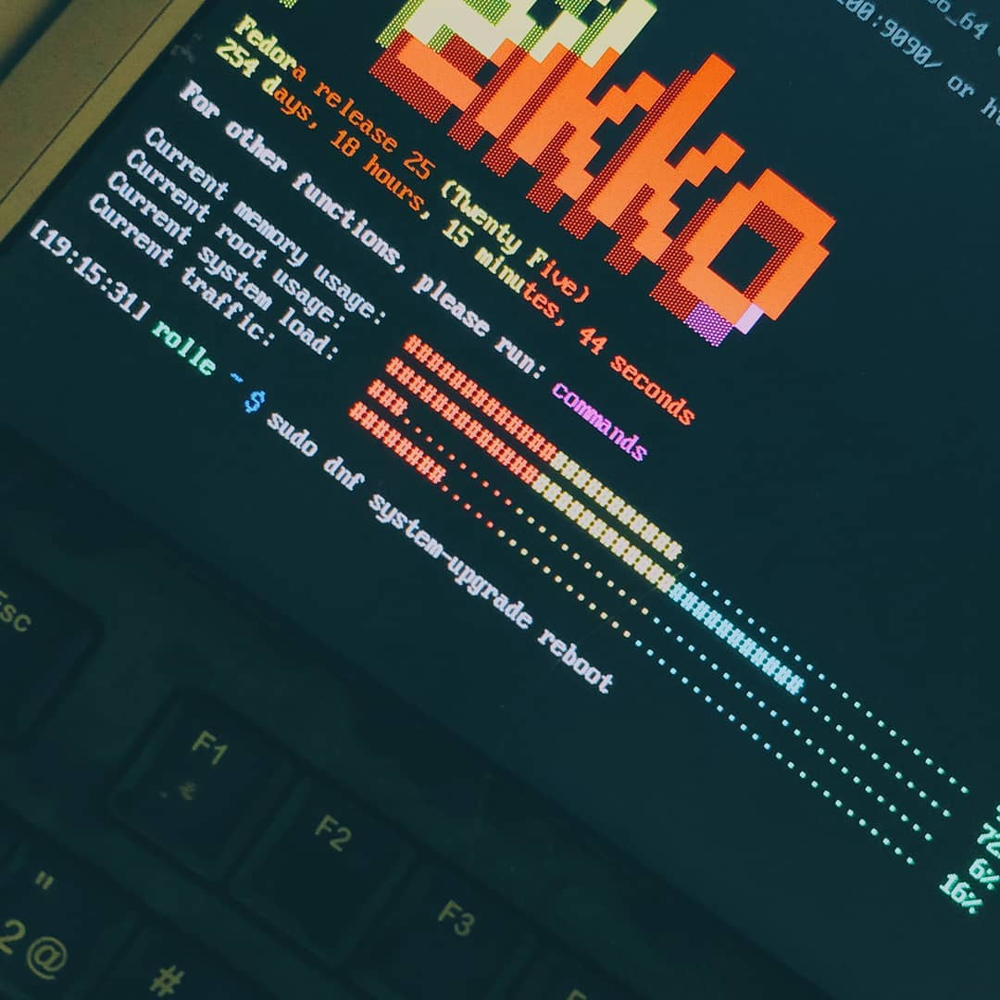
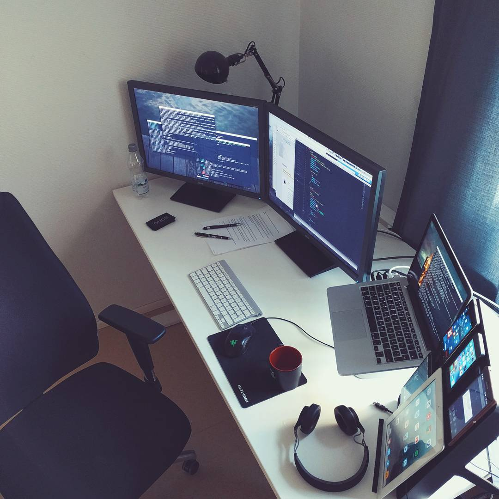

# Administration

### Administration

Mementomori.social was founded by Roni Laukkarinen who is known by his nickname Rolle throughout the Internet. However, instance finances are managed by a Finnish digital agency called [Digitoimisto Dude Oy](https://www.dude.fi/) ("_Osakeyhtiö"_, abbreviated to Oy is the term for a Finnish limited company), of which Roni is also one of the main owners. But rest assured, you are in the safe hands. If you want to know more about the technical details, read about the servers page.

Other admins are [ikkeT](https://mementomori.social/@ikkeT), [raikas](https://mementomori.social/@raikas) and [lari](https://suomi.social/@lari).



#### Digitoimisto Dude Oy

Dude is a web design agency specialized in WordPress and open source. While the company is for-profit they release everything they can in open source, see their [GitHub](https://github.com/digitoimistodude). You should also read [the interview (in Finnish, do translate it) by COSS](https://coss.fi/blogi/dudella-avoin-lahdekoodi-ja-aktiivinen-osallistuminen-yhteison-toimintaan-ovat-osa-menestysta/) – the Finnish Centre for Open Systems and Solutions.

#### About the owner, Roni "Rolle" Laukkarinen

Hello! [👋](https://emojipedia.org/waving-hand/) Let me tell this from the first person perspective. I'm a web developer, entrepreneur and a sysop guy from Finland (it's a small country up north in Europe, Scandinavia, between Russia and Sweden).

Long story short I created my first website in 1998 when I was about 10 years old. I first got into computers through my father who had his first PC during the 80s as a hard core hobbyist and I instantly fell in love with HTML and CSS, the rest of the web languages followed.

<figure><figcaption>
Me in the 90s.
</figcaption></figure> <figure><figcaption>
Me as a teenager.
</figcaption></figure>

First Linux distribution for me was Red Hat variant [Mandrake](https://en.wikipedia.org/wiki/Mandriva_Linux) (later Mandriva) which saw the light of day in 1998. After this during the 2000s I got into servers, again through my father who had his own home server running in a wardrobe (my mom hated that, haha).

I never stopped coding and writing. Been doing this daily ever since. I was full-on Internet very early on. My first touch in social media was with MySpace in the early 2000s, then after that I tried every single one I crossed paths with from Jaiku to Bebo, PicPlz ("Instagram" before Instagram), Friendster, Stumbleupon, Delicious, GetGlue, Google+... There were a lot of them, I counted over 160 social medias. It was more "wild west" back then, people made their own custom CSS and sites based on their profiles. Then came Facebook and ruined everything.

Anyway, on 2013 I started my own company specialized in websites and servers. We provide 100% customized WordPress-websites (without bloat) for our customers. They also get a home for their website with a top notch upkeep service. Dude was born. We are currently only in the Finnish market.

That's about it, I hope you feel you are in safe hands with me.

If you like to know more about me, read for example rolle.design/now page:



<figure><figcaption>
Old office desk, this photo was actually used for recruiting new front-end developers.
</figcaption></figure> <figure><figcaption>
At the office in 2022.
</figcaption></figure>

<figure><figcaption>
The old wardrobe server of my own.
</figcaption></figure> <figure><figcaption>
My old office desk.
</figcaption></figure>

