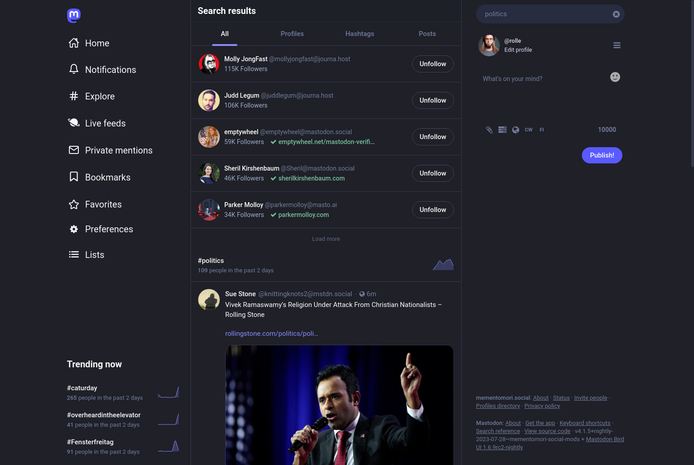

# Instance features

On top of the regular [Mastodon features](https://joinmastodon.org/) like per-post visibility, content warnings and real time feed, Mementomori.social has the following features.

### Mastodon Bird UI

Mastodon Bird UI is something I've been designing since March, 2023. It's a new kind of modern Mastodon UI, inspired by Twitter UI in its good era. Yes, I know, the word bird and Twitter may be a turn-off for some, but I actually like what Twitter made to its UI in [2021](https://twitter.com/TwitterDesign/status/1425505308563099650). The changes after that are not that good, so I took the UI in 2021 as an inspiration and created this:

<figure><figcaption></figcaption></figure>

The UI can be found on [GitHub](https://github.com/ronilaukkarinen/mastodon-bird-ui) and its updates can be followed under hashtags [#BirdUI](https://mementomori.social/tags/birdui) and [#MastodonBirdUI](https://mementomori.social/tags/MastodonBirdUI) on Mastodon.



### Multiple Site themes

On Mementomori.social you get to choose from two major themes with variations:

* Original Mastodon UI (Dark, Light and High contrast versions)
* [Mastodon Bird UI](https://github.com/ronilaukkarinen/mastodon-bird-ui#make-mastodon-bird-ui-as-optional-by-integrating-it-as-site-theme-in-settings-for-all-users) (Dark, Light, High contrast, Ultra accessible versions)

<figure><figcaption></figcaption></figure>

### Ultra accessible theme

On our instance we have focused to accessibility with a special touch towards users with acromatopsia, vision impairment or age vision. **Mastodon Bird UI (Ultra accessible)** theme consists of features such as

* Hashtags, links and mentions are in different colors
* Contrast is even starker than in default High contrast themes, black background with white text
* Font sizes are much larger throughout the site
* The font size is even larger on mobile
* All input boxes and modals have color to distinguish them from the background
* All colors are tested with a contrast checker and with a real person so that they have sufficient contrast ratios

<figure><figcaption></figcaption></figure>

### Bigger link preview cards

~~Default Mastodon has small link previews for URLs. I wanted to make them big and was inspired by~~ [~~this ongoing feature request~~](https://github.com/mastodon/mastodon/issues/19984#issuecomment-1328066798). This is actually now in the Mastodon core, so our instance just follows the core card, but styles it to be more minimal.



<figure><figcaption></figcaption></figure>

### Top and bottom bar scroll out of the way

A subtle change, suggested by [ikkeT](https://mementomori.social/@ikkeT/110685294209812168). See [the post](https://mementomori.social/@rolle/110685777440679654) presenting it. See [JavaScript changes here](https://github.com/ronilaukkarinen/mastodon/blob/e633ae29cd1f5f179da8c7b6f9a3f8478bff5e03/app/javascript/mastodon/common.js#L14-L109) and [Style changes here](https://github.com/ronilaukkarinen/mastodon/blob/e633ae29cd1f5f179da8c7b6f9a3f8478bff5e03/app/javascript/styles/mastodon/basics.scss#L9-L46).

<figure><figcaption></figcaption></figure>

### Allow max. 15 hashtags in the advanced interface columns

The default Mastodon Advanced interface allows 4 hashtags per column. We allow 15. There is [a closed issue](https://github.com/mastodon/mastodon/issues/15194) that is still an issue on 4.1.4.



<figure><figcaption></figcaption></figure>

### Lots of custom emojis

Mementomori.social has a lot of custom emojis. You can also request your own by sending a post to [@rolle](https://mementomori.social/@rolle). Good emoji source: [Slackmojis](https://slackmojis.com/).

<figure><figcaption></figcaption></figure>

### Polls with 15 options and 150 character limit per option

Default Mastodon allows max. 4 options and 50 character limit per option. I have increased them so that posting polls is not too strict.



<figure><figcaption></figcaption></figure>

### Increased character limit to 10000 characters

Mastodon's default is 500. We have 10000. Never have to think about the lenght of your posts any more.



<figure><figcaption></figcaption></figure>

### Show full comment, boost and fav amounts in posts instead of just "1+" or nothing

The Vanilla Mastodon doesn't show these amounts and will likely never show them natively as per [this comment](https://github.com/mastodon/mastodon/issues/420#issuecomment-270891339). However as an OCD person the metrics matter so on Mementomori.social you'll see full amount of comments. (Related [issue on Mastodon](https://github.com/mastodon/mastodon/issues/6600))

Metrics show up on Explore, Bookmarks and Favourites from [31st of July, 2023](https://mementomori.social/@rolle/110807565483442187). Comment count is accurate everywhere.


Please note, currently this is reversed to default due to unreliable method.


<figure><figcaption></figcaption></figure>





### Extended full-text post and account search

~~By default Mastodon searches only for your own posts and the ones you have answered to, if that. Search provided by~~ [~~Elasticsearch~~](https://docs.joinmastodon.org/admin/optional/elasticsearch/)~~. On Mementomori.social you can search all posts the Mastodon instance is aware of, from the users who want to be found ("Include public posts in search results" enabled on settings).~~ This is actually now in the Mastodon core, so our instance just follows the core feature.

<figure><figcaption></figcaption></figure>



### DeepL translations

For posts other than your language (set in profile) a "Translate" link is shown, by pressing it you can see accurate translation provided by [DeepL](https://www.deepl.com/en/translator).

<figure><figcaption></figcaption></figure>

### 500 posts on the Explore tab

By default Mastodon shows 100 posts on the Explore tab. We show 500.



### Snow during winter holidays

Let it snow! [❄️](https://emojipedia.org/snowflake) See [update](https://mementomori.social/@rolle/113708984297929316).



<figure><figcaption></figcaption></figure>

### Fix link previews for youtu.be and m.youtube.com links



In the core version, only www.youtube.com previews work. On mementomori.social, all YouTube link variations generate a preview.

<figure><figcaption></figcaption></figure>

### Autoplay gifs and videos without sound if reduced motion is disabled

Vanilla Mastodon doesn't have a feature for this, gifs and videos are not autoplaying - especially for guests.




