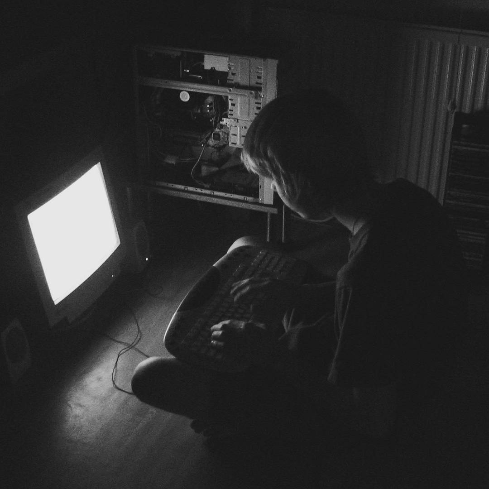
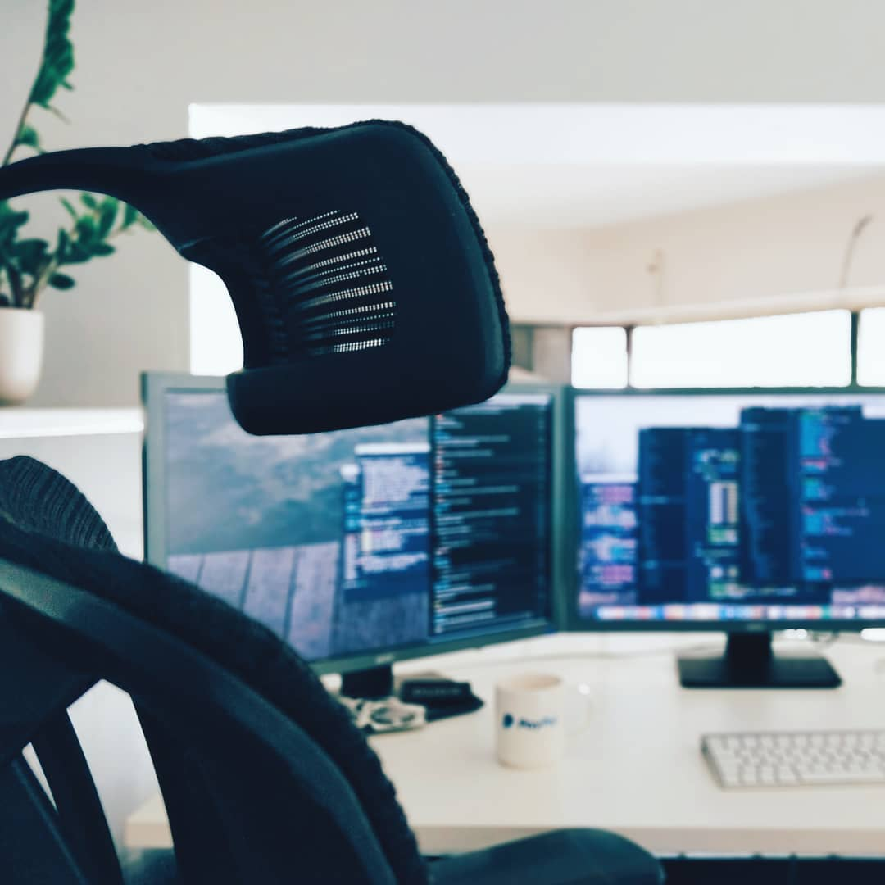
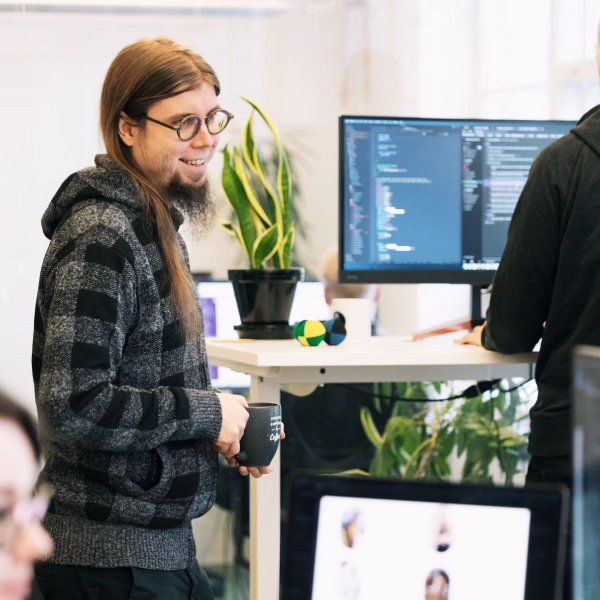

# Ylläpito

### Ylläpito

Tällä hetkellä mementomori.socialia ylläpitää yksittäinen henkilö, Roni Laukkarinen, joka tunnetaan netissä laajalti nimimerkiltään Rolle. Instanssia hostaa suomalainen Digitoimisto Dude Oy, jonka pääomistaja Rolle myös on. Voit siis olla huoleti, olet turvallisissa käsissä.

Muut ylläpitäjät ovat [ikkeT](https://mementomori.social/@ikkeT), [raikas](https://mementomori.social/@raikas) ja [lari](https://suomi.social/@lari).

#### Digitoimisto Dude Oy

Dude on suomalainen digitoimisto, joka on erikoistunut WordPressiin ja avoimeen lähdekoodiin. Vieraile [Duden verkkosivuilla](https://www.dude.fi/) ja lukaise esim. [COSS ry:n haastattelu](https://coss.fi/blogi/dudella-avoin-lahdekoodi-ja-aktiivinen-osallistuminen-yhteison-toimintaan-ovat-osa-menestysta/).

#### Tietoa Mementomori.socialin perustajasta

Moi! [👋](https://emojipedia.org/waving-hand/) Lyhyesti: Olen web-kehittäjä ja palvelinnörtti Jyväskylästä. Loin ensimmäiset verkkosivuni vuonna 1998, olin tuolloin noin kymmenvuotias. Innostuin tietokoneista ensimmäisen kerran isäni kautta, joka hommasi ensimmäisen tietokoneensa 80-luvulla, hän oli kovemman luokan tietokoneharrastaja. Saadessani ensimmäisen tietokoneeni alakouluikäisenä rakastuin HTML:ään ja CSS:ään, loppu on historiaa.

<figure><figcaption>
Minä 90-luvulla.
</figcaption></figure> <figure><figcaption>
Teini-ikäisenä.
</figcaption></figure>

Ensimmäisen kerran tutustuin Linuxiin, kun isäni otti käyttööni Red Hat -variantin Mandraken vuonna 1998. 2000-luvulla asensin myös omalle koneelleni Linuxin. Isäni pyöritti vaatekomerossa kotipalvelinta, tästä äitini ei tietenkään hirveästi tykännyt.

En koskaan lopettanut koodailua tai kirjoittelua. Olen tehnyt tätä lähes päivittäin siitä lähtien kun innostuin. Olin aivan hurahtanut nettiin ensimmäisestä päivästä lähtien. Ensimmäinen kosketukseni sosiaaliseen mediaan tapahtui MySpacen kanssa 2000-luvun alkupuolella, tämän jälkeen kokeilin ihan kaikkia yksi kerrallaan. Vastaan tuli esim. Jaiku, Bebo, PicPlz (silloinen "Instagram"), Friendster, Sumbleupon, Delicious, GetGlue, Google+, ja niin edelleen. Palveluita oli paljon, laskin että ainakin yli 160 kpl. Silloin Internet oli enemmän "villi länsi", ihmiset tekivät omia muokkailujaan CSS:llä ja profiilit olivat värikkäitä ja kirjavia. Sitten Facebook tuli ja pilasi kaiken.

Joka tapauksessa vuonna 2013 aloitin oman yrityksen, joka keskittyy verkkosivuihin ja palvelimiin. Tarjoamme 100% räätälöityjä WordPress-verkkosivustoja (ilman bloattia) asiakkaillemme. Lisäksi kattauksessa on ylläpitopalvelu, jolla verkkosivut saavat ansaitsemansa kodin.

<figure><figcaption></figcaption></figure> <figure><figcaption></figcaption></figure>

Siinäpä se pähkinänkuoressa, toivottavasti tuntuu että tunnarisi on turvallisissa käsissä. Jos haluat tietää minusta lisää, tsekkaile esim. blogini infosivu:


